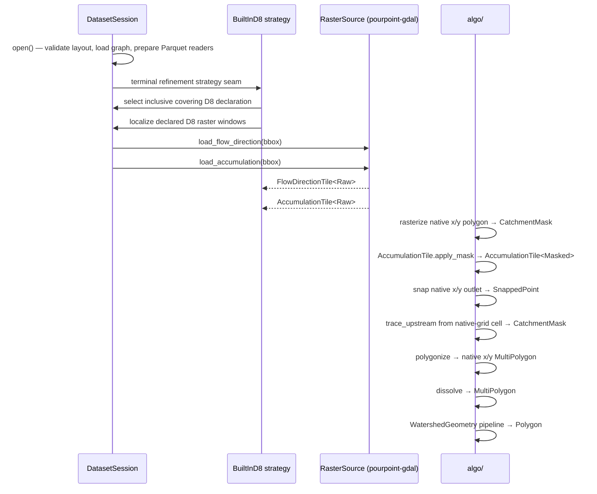

# pourpoint-core

Pure-Rust core library for the pourpoint watershed extraction engine. It handles two responsibilities: loading HFX datasets from disk (`session` + `reader`), and providing all watershed-delineation algorithms (`algo`). External capabilities — GDAL raster I/O, GEOS geometry repair — are kept behind traits defined here and implemented in `pourpoint-gdal`, so the hot path has no native dependencies.

## Snap Strategy

`ResolverConfig::new()` defaults to `SnapStrategy::WeightFirst` to align with the HFX v0.2 weight contract, which requires that the `weight` column be monotonically increasing in drainage dominance (higher weight = more hydrologically significant reach). Under this default, when an outlet is coincident with a tiny tributary stub, the hydrologically dominant mainstem candidate wins over the geometrically closest one. `SnapStrategy::DistanceFirst` remains available for datasets whose `weight` column is not rank-meaningful: configure it via `ResolverConfig::new().with_snap_strategy(SnapStrategy::DistanceFirst)`.

## Staged Delineation Contract

Staged delineation is implemented around typed intermediate outputs while the
stable `Engine::delineate` surface remains the public one-call API.

Public delineation results are unit-named at the Rust API boundary:
`terminal_unit_id()`, `upstream_unit_ids()`, `resolved_outlet()`,
`resolution_method()`, and `geometry_wkb()` are the stable accessors consumed by
downstream export work.


```rust
pub fn select_level(&self, choice: LevelSelection) -> Result<SelectedLevel, EngineError>;

pub fn resolve_outlet_at_level(
    &self,
    outlet: GeoCoord,
    level: SelectedLevel,
    config: &ResolverConfig,
) -> Result<LevelResolvedOutlet, EngineError>;

pub fn traverse_upstream_at_level(
    &self,
    outlet: &LevelResolvedOutlet,
) -> Result<SameLevelUpstreamUnits, EngineError>;

pub fn produce_pre_merge_units(
    &self,
    upstream: &SameLevelUpstreamUnits,
) -> Result<PreMergeDrainageUnits, EngineError>;

pub fn refine_terminal_placeholder(
    &self,
    resolved: &LevelResolvedOutlet,
    units: &PreMergeDrainageUnits,
    options: &DelineationOptions,
) -> Result<TerminalRefinement, EngineError>;

pub fn dissolve_watershed(
    &self,
    units: &PreMergeDrainageUnits,
    refinement: &TerminalRefinement,
    options: &DelineationOptions,
) -> Result<DissolvedWatershed, EngineError>;

pub fn compose_result(
    &self,
    resolved: LevelResolvedOutlet,
    upstream: SameLevelUpstreamUnits,
    units: &PreMergeDrainageUnits,
    refinement: TerminalRefinement,
    dissolved: DissolvedWatershed,
) -> DelineationResult;
```

`PreMergeDrainageUnit` is an inspection record for pristine upstream drainage
units. The collection includes the whole terminal polygon before any terminal
refinement. This distinction is intentional: pre-merge drainage-unit records
are pristine inspection records and do not define final watershed output after
refinement. Summing pre-merge `area` values does not define final `area_km2`,
and unioning pre-merge geometries does not define final refined geometry. Final
geometry and area are produced only by the downstream dissolve/assemble stage.
Export persistence, including future GeoParquet output, must consume the
composed final result instead of treating pre-merge records as the final basin.

The Rust terminal-refinement strategy seam is exposed with a deliberately
D8-specific context: the strategy receives the `DatasetSession` plus the
engine-attached `RasterSource` needed by the built-in D8 path. Full custom
auxiliary binding and general auxiliary-to-strategy dispatch are outside the
current runtime surface.

## Architecture

```mermaid
graph TD
    session[DatasetSession\nsession.rs] --> reader[reader/]
    reader --> manifest[manifest.rs\nparse manifest.json]
    reader --> graph[graph.rs\ndecode graph.parquet]
    reader --> catchment[catchment_store.rs\nlazy Parquet reader]
    reader --> snap[snap_store.rs\nlazy Parquet reader]
    reader --> d8decl[hfx.aux.d8_raster.v2\nD8 declarations]
    session --> refinement[refinement.rs\nterminal strategy seam]
    refinement --> d8strategy[BuiltInD8 strategy\nD8-only pantry]
    d8strategy --> session

    algo[algo/] --> foundation[Foundation Types\ncoord · area · distance\ngeo_transform · flow_dir\nsnap_threshold · clean_epsilon\ntile_state]
    algo --> raster_infra[Raster Infrastructure\nraster_tile · flow_direction_tile\naccumulation_tile · catchment_mask]
    algo --> algorithms[Raster Algorithms\ntrace · snap · rasterize · polygonize]
    algo --> graph_traversal[Graph Traversal\ncollect_upstream]
    algo --> geometry[Geometry Processing\ndissolve · clean_topology · hole_fill\nlargest_polygon · watershed_area\nself_intersection]
    algo --> pipeline[Pipeline + Traits\nwatershed_geometry · traits]

    traits[traits.rs] -.->|implemented by| pourpoint_gdal[pourpoint-gdal]
```

**Data flow for a delineation:**



## Terminal Refinement Scope

The engine currently ships exactly one built-in terminal-refinement strategy:
D8 raster refinement. The current strategy context is intentionally D8-only.
Full auxiliary schema-to-strategy binding, reverse-DNS auxiliary parsing,
Python-authored strategies, and additional built-in strategies are outside the
current runtime surface.

The built-in D8 carve sequence is fixed as:

```text
rasterize terminal -> mask flow-dir + accumulation -> snap -> masked trace -> polygonize
```

Inside this carve stack, `GeoTransform`, rasterization, snapping, tracing,
polygonization, `SnappedPoint`, and `RefinementResult` use raster-native x/y
coordinates. The complete data flow is:

```text
EPSG:4326 terminal -> per-declaration forward projection -> native coverage and localization
-> native raster carve and snap -> inverse carved rings and outlet only -> EPSG:4326 result
```

D8 grids are never warped, resampled, or reprojected. Supported declaration
CRSs are exactly the existing `Crs` variants. An unsupported declaration CRS is
a D8 selection error. The selected carved rings and snapped outlet are the only
values inverse-transformed, and component, ring, and vertex order is retained.
The EPSG:4326 identity path remains byte-exact because its forward and inverse
operations only move coordinate fields.

For `cells`, snapping preserves `threshold.as_f32()` behavior. For `km2`, the
effective threshold is evaluated as
`threshold_cells as f64 * (pixel_width * pixel_height).abs() / 1_000_000.0`;
the completed result is cast exactly once to `f32` and compared directly with
the raw `f32` accumulation sample. EPSG:4326 plus `km2` is a refinement error
because geographic pixel area is not approximated.

`forward` remains instrumented, so selection produces one existing-default-level
span per ring vertex per candidate declaration. Unsupported CRS failures travel
through `EngineError::D8Selection` and map to Python `DatasetError`.
Geographic-`km2` and inverse failures travel through `EngineError::Refinement`
and map to generic Python `PourpointError`; this classification difference
preserves the existing `EngineError` variants.

There is no vector clamp, intersection, or cleaning pass in the refinement
algorithm. Final watershed assembly is always merge-after: preserve pristine
pre-merge unit records for inspection, exclude the whole terminal from final
assembly, insert the refined terminal geometry, and then dissolve/assemble. This
is why pristine pre-merge terminal geometry and area can differ from the final
refined geometry and `area_km2`.

D8 tile coverage uses inclusive rectangle semantics, so exact bbox equality and
edge-touching count. This is a rectangular-extent selection policy. When more
than one declaration fully covers the terminal bbox — the expected case for a
per-Pfaf-02 partitioned D8 fabric, where irregular basins have overlapping
rectangular extents — selection collapses to the manifest-first covering
declaration and logs the discarded candidates at `warn`. This is sound because
`hfx.aux.d8_raster.v2` requires overlapping entries to be windows of a single
coherent D8 fabric (byte-identical values in the overlap), and the carve never
reads outside the terminal bbox, so any covering tile yields the same carve.
Real MERIT-Hydro `merit/0.2.0` for `rhine_basel` therefore carves successfully.
[`SessionError::AmbiguousD8Coverage`] is retained for callers that need the
un-collapsed candidate set or for fabrics whose overlap-agreement is not
guaranteed. `TerminalSpansD8Tiles` (bbox straddles a boundary, no single tile
fully covers it) and `NoCoveringD8Tile` still hard-error.

Every `hfx.aux.d8_raster.v2` declaration requires typed `crs`,
`flow_dir_encoding`, and `flow_acc_units` metadata. Flow direction accepts
`uint8` or `int8`; accumulation accepts `float32` or `int32`, with `cells`
requiring `float32`. Signed values normalize at the reader boundary to the
engine's existing `RasterTile<u8>` and `RasterTile<f32>` representations.

Regression gates for the D8 strategy seam and synthetic parity goldens:

```bash
cargo build --workspace --exclude pourpoint-python
cargo check -p pourpoint-python
cargo test -p pourpoint-core --test d8_refinement_parity
cargo test -p pourpoint-core --test d8_aux_accessor
cargo test -p pourpoint-core --test parity_golden_artifacts
cargo test -p pourpoint-core --test staged_delineation
```

Network-gated boundary proof:

```bash
POURPOINT_HFX_V02_REAL_D8_REFINEMENT=1 cargo test -p pourpoint-core --test d8_refinement_parity -- --ignored --nocapture
```

These gates do not verify successful real-data carving on overlapping-Pfaf
terminals; they verify that the offline D8 path works and that the typed
ambiguity boundary is surfaced for real MERIT coverage conflicts.

## Glossary

| Term | Meaning |
|---|---|
| Unit | Fundamental spatial unit in HFX — one catchment polygon with an ID, area, and WKB geometry |
| UnitId | Unique positive `i64` identifier for a unit (newtype in `hfx`) |
| D8 | Eight-direction flow model where each raster cell drains to exactly one of its 8 neighbours |
| ESRI D8 | D8 encoding using powers of two: E=1, SE=2, S=4, SW=8, W=16, NW=32, N=64, NE=128 |
| TauDEM D8 | D8 encoding counter-clockwise from east: E=1, NE=2, N=3, NW=4, W=5, SW=6, S=7, SE=8 |
| Upstream set | All units reachable via upstream adjacency from a terminal unit, inclusive of the terminal itself |
| Pour point | The outlet cell of a watershed — the single cell where flow exits the catchment |
| Snap | Moving a pour point to the nearest high-accumulation cell within a catchment mask |
| SnapThreshold | Minimum flow-accumulation pixel count a cell must exceed to be a snap candidate |
| Dissolve | Boolean union of all catchment polygons in the upstream set into one multi-polygon |
| CleanEpsilon | Tiny buffer distance (degrees) used in buffer-unbuffer topology cleaning |
| HoleFillMode | Policy for interior holes: remove all, or keep holes above an area threshold |
| Typestate | Compile-time state tracking via zero-size type parameters (`Raw`/`Masked`, `Dissolved`/`TopologyCleaned`/`HolesFilled`) |
| GeoTransform | GDAL-style affine transform mapping raster-native x/y coordinates to pixels (no rotation/shear) |
| NativeCoord | Typed raster-native x/y coordinate used inside the raster carve stack |
| Row-group pruning | Skipping Parquet row groups whose bbox statistics don't intersect the query bbox |

## Key Types

### Session / Reader layer

| Type | File | Role |
|---|---|---|
| `DatasetSession` | `session.rs` | Entry point — open an HFX dataset, validate layout, expose readers |
| `RasterPaths` | `session.rs` | Validated paths to `flow_dir.tif` + `flow_acc.tif` (no GDAL handles) |
| `TerminalRefinementStrategy` | `refinement.rs` | Object-safe terminal-refinement seam; the current strategy context is D8-only |
| `CatchmentStore` | `reader/catchment_store.rs` | Lazy Parquet reader for `catchments.parquet` with bbox pruning |
| `SnapStore` | `reader/snap_store.rs` | Lazy Parquet reader for `snap.parquet` with bbox pruning |
| `SessionError` | `error.rs` | All dataset-open and read errors |

### Algorithm layer

| Type / Function | File | Role |
|---|---|---|
| `WatershedGeometry<S>` | `algo/watershed_geometry.rs` | Typestate pipeline: `Dissolved` → `TopologyCleaned` → `HolesFilled` → `Polygon` |
| `FlowDirectionTile<S>` | `algo/flow_direction_tile.rs` | Typed D8 raster tile; `S` is `Raw` or `Masked` |
| `AccumulationTile<S>` | `algo/accumulation_tile.rs` | Typed flow-accumulation tile; `apply_mask` transitions `Raw` → `Masked` |
| `CatchmentMask` | `algo/catchment_mask.rs` | Boolean visited-cell set; output of `trace_upstream` and `rasterize_polygon` |
| `RasterTile<T>` | `algo/raster_tile.rs` | Generic row-major tile with OOB-safe `(isize,isize)` indexing |
| `GeoTransform` | `algo/geo_transform.rs` | Pixel ↔ raster-native x/y coordinate conversion |
| `FlowDir` | `algo/flow_dir.rs` | D8 direction enum with ESRI and TauDEM decoding |
| `SnappedPoint` | `algo/snap.rs` | Result of a successful pour-point snap (grid cell + native x/y coordinate + accumulation) |
| `RefinementResult` | `algo/refine.rs` | Native snapped coordinate and raster-native refined polygon |
| `snap_pour_point` | `algo/snap.rs` | Snap outlet to nearest masked cell above `SnapThreshold` |
| `trace_upstream` | `algo/trace.rs` | DFS upstream traversal returning a `CatchmentMask` |
| `collect_upstream` | `algo/upstream.rs` | BFS upstream traversal over `DrainageGraph` |
| `dissolve` | `algo/dissolve.rs` | Parallel boolean union of polygon slices |
| `RasterSource` | `algo/traits.rs` | Trait for windowed GeoTIFF reads; implemented by `pourpoint-gdal::GdalRasterSource` |
| `GeometryRepair` | `algo/traits.rs` | Trait for geometry repair; implemented by `pourpoint-gdal::GdalGeometryRepair` |
