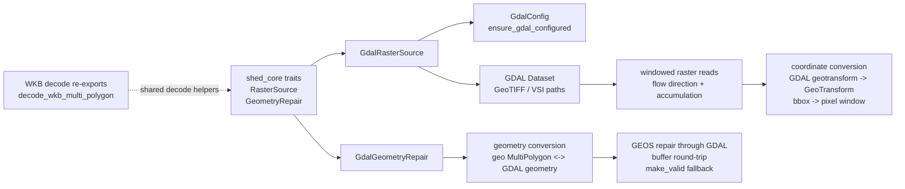

# shed-gdal

## Purpose

`shed-gdal` is the GDAL/GEOS bridge for `shed-core`: it provides windowed raster reads and geometry repair through implementations of the `RasterSource` and `GeometryRepair` traits, while keeping native GDAL and GEOS dependencies out of the core engine crate.

## Architecture

## Glossary

| Term | Meaning |
|---|---|
| COG | Cloud Optimized GeoTIFF; a GeoTIFF layout that supports efficient ranged reads over remote storage |
| Window read | A raster read limited to the pixel window intersecting a geographic bounding box |
| Geotransform | GDAL's six-value affine transform mapping pixel coordinates to geographic coordinates |
| VSI path | GDAL virtual filesystem path, such as remote object-store paths handled through GDAL drivers |
| Flow direction tile | D8 raster window decoded into `shed_core`'s typed flow-direction tile |
| Accumulation tile | Flow-accumulation raster window decoded into `shed_core`'s typed accumulation tile |
| WKB | Well-Known Binary geometry encoding used by HFX catchment artifacts |
| GEOS repair | Geometry validation and repair performed through GDAL's GEOS-backed operations |
| `make_valid` | GDAL/OGR fallback repair operation used when the buffer round-trip does not produce a valid geometry |

## Key Types

| Type / Function | Module | Role |
|---|---|---|
| `GdalRasterSource` | `raster_reader.rs` | Implements `shed_core::algo::traits::RasterSource` with GDAL-backed windowed raster reads |
| `GdalGeometryRepair` | `geometry_repair.rs` | Implements `shed_core::algo::traits::GeometryRepair` with GDAL/GEOS geometry repair |
| `GdalConfig` | `config.rs` | Carries source-specific GDAL runtime configuration, including S3-compatible endpoint settings |
| `ensure_gdal_configured` | `config.rs` | Applies process-wide GDAL/CPL options needed for remote raster reads |
| `RasterReadError` | `error.rs` | Typed error for GDAL raster open, read, transform, and tile-construction failures |
| `GdalRepairError` | `error.rs` | Typed error for GDAL-backed geometry repair failures |
| `decode_wkb_multi_polygon` | `wkb.rs` | Re-exported WKB decoder for HFX multipolygon geometry bytes |
| `decode_wkb_polygon` | `wkb.rs` | Re-exported WKB decoder for polygon geometry bytes |
| `decode_wkb` | `wkb.rs` | Re-exported generic WKB decoder from `shed-core` |
