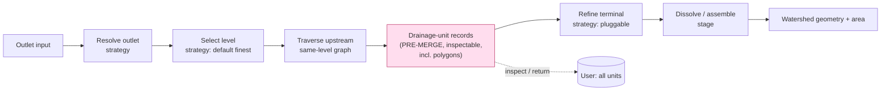

# shed v0.2 Refactor + Redesign — Broad Roadmap

> Status: **draft / vision-level**. Produced from a grill session on 2026-06-02.
> This document fixes the high-level decisions and ordering. It deliberately
> leaves several mechanisms as **"plan further"** items for dedicated follow-up
> sessions. It is not an implementation spec.

## Vision

`shed` consumes HFX v0.2.x datasets and performs watershed delineation. HFX has
been redesigned around **multi-level drainage units** and **manifest-declared
auxiliary data**, and explicitly delegates delineation algorithm, level
selection, refinement strategy, and geometry assembly to the engine. This
redesign makes `shed` match that contract and turns the delineation pipeline
from a single monolithic call into a **fixed skeleton of typed, inspectable
sub-steps** with **Rust-native pluggable strategies** — especially around
refinement. The defining principle: **the intermediate types are the interface.**
Get the per-stage types right and both "inspect a step" and "swap a step" fall
out for free.

## Locked decisions

| # | Decision | Choice |
|---|----------|--------|
| 1 | Sequencing | **Unified redesign.** Port to v0.2.x directly into the new staged/pluggable architecture. No faithful v0.1-shaped port + later rewrite. |
| 2 | Multi-level scope | Data is **multi-level-aware**, but for now **default to the finest level** = `max(level)` present in the dataset, with same-level graph traversal. Level selection is deferred and will itself be a *strategy* (e.g. "coarser if basin > X", "pull higher-res units near outlet"). |
| 3 | API paradigm | **Fixed skeleton + pluggable strategies.** Canonical stage order; each stage produces a typed, independently inspectable intermediate; each swappable stage is a trait. |
| 4 | Strategy authoring | **Rust-native now.** Custom strategies = Rust trait impls. Python (pyshed) gets **inspection of every step + a built-in strategy menu**. Python-*authored* strategies are a later, scoped phase. |
| 5 | Pre-merge output | The "step before merging" returns **full per-unit drainage-unit records including polygons** (id, level, area, up_area, outlet, geometry). Dissolve/merge is a **separate downstream stage** consuming those records. Users wanted *all drainage units as output, not just the merged polygon.* |
| 6 | Aux → strategy binding | **Deferred — roadmap TODO** (see below). How a strategy declares and receives the aux data it needs is its own design session. |
| 7 | v0.1 support | **Hard cut.** Drop all v0.1 loading; `shed` reads only HFX v0.2.x, mirroring HFX's own hard cut. |
| 8 | pyshed timing | **Rust core first, then pyshed.** Stabilize the staged Rust API + types, then redesign the Python surface as a distinct phase (with its own grill). |

## Key facts from HFX v0.2.1 (driving the port)

- `graph.arrow` → **`graph.parquet`** (+ new `bbox_*` columns); v0.1 Arrow rejected.
- Root `snap.parquet` / `flow_dir.tif` / `flow_acc.tif` → declared in
  **`manifest.json::auxiliary[]`** by schema ID (`hfx.aux.snap.v1`,
  `hfx.aux.d8_raster.v1`). Multiple snap entries allowed, each pinned to levels.
- "Atom" → **"drainage unit"**; model is multi-level via `level` + `parent_id`
  forest (perfect nesting). Manifest dropped `atom_count`, `terminal_sink_id`,
  `has_rasters`, `has_snap`, `fabric_level`; added `unit_count`, `topology`.
- `is_mainstem` bool → **`stem_role`** enum (4 values incl. `distributary`).
- `format_version` must equal `"0.2.1"`; CRS fixed `EPSG:4326`.
- `<reverse-dns>.*` aux namespace lets producers ship **arbitrary custom aux**
  and stay conformant — the basis for custom refinement strategies.

## Target pipeline shape

Every box is a typed intermediate the caller can stop at and read. Boxes marked
"strategy" are trait seams (Rust-native swappable); the rest are stages with
fixed typed contracts.

## Refinement vision (working draft)

> Produced from a second grill session on 2026-06-02, focused solely on what
> custom refinement (and level-selection) strategies should *do*. Sharpens the
> refinement framing above. **Still brainstorming — nothing here is final;**
> these are the current working positions, open to change as feedback lands.

**The shape: a transparent glass pipeline with exactly one door.** Two pillars:

- **One plug point — refinement.** It is the *only* thing a user can customize.
  This is the entire reason auxiliary data was added to HFX: aux exists to feed
  refinement strategies. Everything else (resolve, traverse, dissolve) is fixed.
- **Total transparency.** Every step is a typed, inspectable intermediate. The
  sub-step decomposition exists for *inspection*, not swappability. You can
  *see* every step's output (with provenance — *why* it resolved/refined the way
  it did); you can only *replace* refinement.

**Working refinement positions:**

| # | Decision | Choice |
|---|----------|--------|
| R1 | What refinement IS | A way to **shrink the terminal (final) drainage unit**. Terminal-only, by definition. Not a general boundary-editor. |
| R2 | Output type | **Geometry, not unit records.** A polygon *contained within* the terminal. "Shrink" is **definitional** (not just the default) — containment is what keeps the merge overlap-free. The carved terminal only ever appears inside the final merged geometry, never as its own unit in any list. |
| R3 | Two inspection outputs, allowed to disagree | The **pristine pre-refinement unit list** (whole units, incl. the whole terminal) answers *"which units are upstream."* The **final merged geometry** (carved terminal) answers *"precise watershed/area."* Summing unit areas ≠ final `area_km2`; unioning unit polygons ≠ final geometry. **Documented, intentional.** No reconciled "refined units" view. |
| R4 | Always merge after | Refinement never replaces the merge; it only changes what the terminal contributes. Refine-ON = dissolve(whole upstream units − terminal + carved terminal); refine-OFF = dissolve(all whole units). |
| R5 | The pantry (inputs) | **Maximal, lazy, declared.** A strategy may reach *any* declared aux. **Typed accessors for blessed aux** (`hfx.aux.d8_raster.v1`, `hfx.aux.snap.v1` — shed reads what it designed). **Raw resolved path + metadata for custom `<reverse-dns>` aux** — the strategy author parses what they invented; shed stays schema-agnostic (mirrors HFX's "structural checks only"). Producer of the aux and author of the strategy are usually the same party. |
| R6 | Failure — no silent downgrades | An explicitly-invoked step with missing declared data **hard-errors**, naming what's missing. The convenience `delineate()` stays friendly via a **named best-effort default strategy** ("refine if aux present, else whole terminal") — best-effort is *visible and named*, not a hidden skip. |
| R7 | What ships | **Exactly one blessed strategy: D8 raster refinement** (today's behavior, parity-proven by fixtures). No other refinement strategies. Real deliverables: **the refinement contract** + **exposing everything a strategy needs**. Users author their own in Rust. |

**Seam taxonomy (sharpens TODO #2):** refinement is the **only user-authored
seam**. `traverse` and `dissolve` are **fixed law** (pure topology / geometry
plumbing, no policy). `resolve outlet` stays **config-driven** (existing
`SnapStrategy` enum) and *inspectable*, architected to graduate to a full seam
later but **not** user-authored in this round. `select level` is a **thin,
speculative seam** — default finest, no concrete use case; "finer units near
outlet" lives here (or nowhere yet), **not** in refinement.

**Parity discipline:** before any seam work, capture fixtures from the current
engine and use them as parity gates — the D8 default strategy must reproduce
today's containment-clamped carve exactly (`refine.rs`: mask both tiles → snap
to high-accumulation cell → masked D8 upstream trace → polygonize → sub-polygon
that replaces the terminal in dissolve).

**Driver context:** there is **no concrete custom-refinement use case in hand
yet**. The redesign is driven by feedback to *expose more* + the HFX v0.2 data
model change, and by making refinement swappable *for the future*. The seam is
designed for unknown, feedback-driven strategies — hence the maximal pantry and
the "we ship the contract, not a menu" stance.

## Phases

### Phase 0 — Type & stage-contract design (keystone)
Define the intermediate-type vocabulary and the stage contracts. Because *the
types are the interface*, this is the design that everything else implements.
Deliverable: the typed inputs/outputs for resolve, level-select, traverse,
unit-records, refine, dissolve — plus the trait signature(s) for swappable
stages. Likely its own design grill.

### Phase 1 — HFX v0.2.x loading layer (hard cut)
Rewrite the reader/session layer for v0.2.x: new manifest fields,
`catchments.parquet` multi-level columns (`level`, `parent_id`, `up_area_km2`,
`stem_role`), `graph.parquet`, and `manifest.auxiliary[]` parsing (blessed +
generic custom handle). Delete all v0.1 loaders (`graph.arrow`, root
snap/raster paths, atom/`terminal_sink_id`). Update `FormatVersion` gate.

### Phase 2 — Staged delineation skeleton with inspectable intermediates
Decompose the monolithic `delineate()` into the fixed skeleton above. Each stage
is independently callable and returns its typed intermediate. **Includes the
pre-merge drainage-unit records output and dissolve as a separate stage**
(decision #5). The convenience one-call `delineate()` becomes a thin composition
over the stages.

### Phase 3 — Pluggable refinement strategy seam
Introduce the refinement-strategy trait; reimplement the current D8 algorithm as
the **default** strategy. Establishes the pattern for other future strategy
seams (resolution, level selection, dissolve). NOTE: full custom-aux-driven
refinement is blocked on the aux-binding TODO; default strategy can use the
existing raster source seam in the meantime.

### Phase 4 — pyshed redesign
Expose the inspectable stages and unit-record outputs to Python; apply the
atom→drainage-unit terminology; surface the built-in strategy menu. Distinct
grill, especially re: how/whether to later support Python-authored strategies.

### Future (explicitly out of scope for this redesign)
- **Multi-level / level-selection strategies** (mixed-level traversal,
  cross-level transitions, basin-size-driven level choice).
- **Python-authored strategies** (FFI callback bridge, GIL, Python-visible
  mirrors of intermediate types).

## "Plan further" TODOs (each its own session)

1. **Aux → strategy binding mechanism** (decision #6 deferred): how a strategy
   declares which aux schema IDs it needs, how the engine resolves
   `manifest.auxiliary[]` to typed accessors, and how custom `<reverse-dns>.*`
   schemas surface to a strategy. *Central to the "flexible refinement off aux
   data" vision.*
2. **Strategy seam taxonomy**: which stages become trait seams now
   (refinement only?) vs later (resolution, level selection, dissolve)? How many
   interfaces, and their exact signatures.
3. **Intermediate type design** (Phase 0): the concrete typed contracts and how
   they stay inspection-friendly across the future FFI boundary.
4. **Level-selection strategy design** (the multi-level "why we have levels"
   use cases).
5. **Python-authored strategies**: FFI callback design (later phase).
6. **Terminology migration**: atom → drainage unit across types, CLI, telemetry
   stage names, errors, fixtures.
7. **Error & versioning model**: missing-aux errors, version-mismatch behavior,
   `topology` tree-vs-dag handling.
8. **Public API breakage / migration**: this is a breaking redesign of both the
   Rust and Python surfaces — plan the version story and any migration notes.

## Open questions surfaced but not yet resolved

- Does the default level-selection (finest) need to be overridable via a simple
  parameter before the full strategy lands? (Cheap win vs scope creep.)
- Should `dissolve` itself be a strategy seam (custom merge logic) or a fixed
  stage? **Current lean (R-grill): fixed** — refinement is the only
  user-authored seam; see "Refinement vision (working draft)". Revisit if
  feedback demands custom merge logic.
- How do multiple `hfx.aux.snap.v1` entries (per-level) interact with the
  default finest-level choice during outlet resolution?
